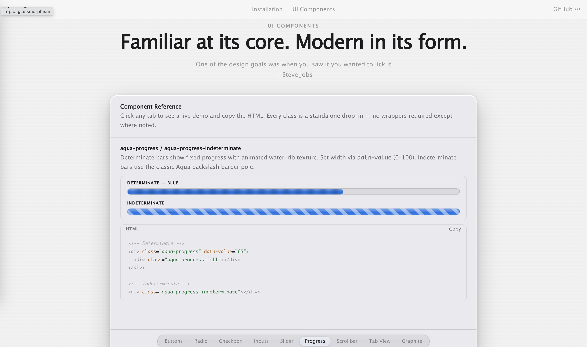

# Aqua2

A self-contained UI framework for the web, inspired by Apple's Aqua design language. Build beautiful glassmorphic interfaces with smooth animations and light/dark mode support—no dependencies required.

## Demo



[Live Demo](https://thatdhruv.github.io/aqua2/)

## Features

- **Apple Aqua aesthetics** — Authentic glassmorphism effects with gradient overlays
- **Complete component library** — Buttons, inputs, dropdowns, sliders, progress bars, scrollbars, and tabs
- **Built-in animations** — Spring-like transitions and interactive feedback
- **Light & dark modes** — CSS custom properties for easy theme switching
- **Zero dependencies** — Self-contained vanilla JavaScript
- **Responsive design** — Touch-friendly with pointer event handling

## Quick Start

### Installation

Simply include `aqua2.js` in your HTML:

```html
<script src="aqua2.js"></script>
```

### Basic Usage

```html
<!-- Button -->
<button class="aqua-button">Click me</button>

<!-- Text Input -->
<input type="text" class="aqua-input" placeholder="Enter text...">

<!-- Slider -->
<input type="range" class="aqua-slider">

<!-- Dropdown -->
<select class="aqua-select">
  <option>Option 1</option>
  <option>Option 2</option>
</select>

<!-- Tabbed Interface -->
<div class="aqua-tabs">
  <button class="aqua-tab-button">Tab 1</button>
  <button class="aqua-tab-button">Tab 2</button>
</div>
```

## Components

| Component | Features |
|-----------|----------|
| **Buttons** | Standard, circular, and square variants; aqua & graphite styles |
| **Inputs** | Text fields with focus effects and animations |
| **Sliders** | Draggable thumbs with smooth value changes |
| **Dropdowns** | Animated panels with open/close mechanics |
| **Progress Bars** | Determinate and indeterminate states |
| **Scrollbars** | Custom styled with navigation buttons |
| **Tabs** | Keyboard and pointer support with smooth indicators |
| **Checkboxes & Radios** | Animated state transitions |

## Design Philosophy

Aqua2 recreates Apple's iconic interface language with modern web technologies. Every interaction includes subtle animations and visual feedback, creating a polished, responsive experience familiar to macOS and iOS users.

## Browser Support

Works in all modern browsers supporting CSS custom properties and backdrop filters (Chrome/Edge 76+, Firefox 103+, Safari 15+).

## License

See [LICENSE](LICENSE) file for details.
